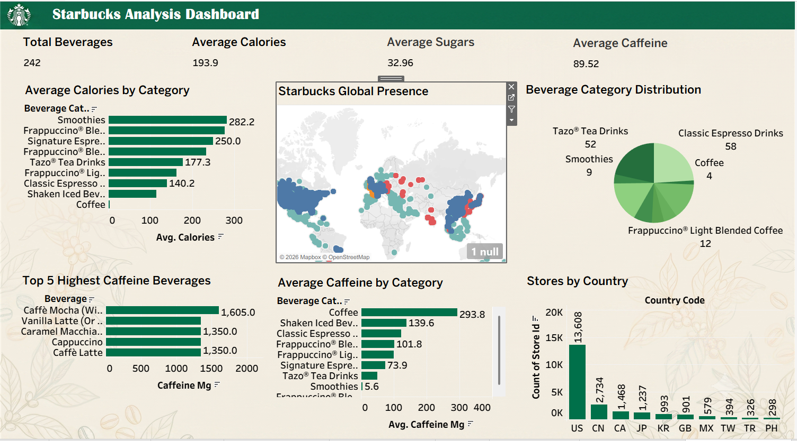

# Starbucks Analysis Dashboard

A data analyst project that cleans Starbucks data with Python, models it in SQL, and builds an interactive dashboard in Tableau.

Live dashboard: https://public.tableau.com/shared/M7DWBQR2M?:display_count=n&:origin=viz_share_link

## Dashboard preview



## What this project does

Takes raw Starbucks data and turns it into an interactive dashboard. The questions it answers:

- Which drinks have the most calories, sugar, and caffeine?
- How are Starbucks stores spread across the world?
- What are the top 5 highest caffeine drinks?

## Tools used

- Python (pandas) for cleaning the data
- MySQL for storing it and writing the queries
- Tableau Public for the dashboard

## The data

Two datasets.

Beverage nutrition, 242 drinks: calories, sugar, caffeine, fat, and other nutrition facts. From the Kaggle set "Nutrition facts for Starbucks Menu", via a GitHub mirror.

Store locations, 25,600 stores: country, city, coordinates, and ownership type. From chrismeller/StarbucksLocations on GitHub.

## How it works

### Step 1: Clean the data (Python + pandas)

The raw data had a few problems.

Nutrition:

- Column names were messy, so I made them lowercase with underscores
- One value read "3 2" where it should have been "3.2"
- 23 caffeine values said "Varies", so I blanked those to keep them out of the averages
- Vitamin columns had "%" signs on them, so I stripped those and converted the columns to numbers
- Checked for duplicate rows and found none

Stores:

- Kept the seven columns I needed and dropped the rest
- Ownership codes were abbreviated, so CO became Company Owned and LS became Licensed Store
- One store has no coordinates. I kept it anyway so the store counts stay right.

### Step 2: Model the data (MySQL)

Created two tables, `nutrition` and `stores`, loaded the clean data in, then wrote queries for the KPIs:

- Average calories, sugar, and caffeine
- Top 5 highest caffeine drinks
- Store counts by country and ownership type

### Step 3: Build the dashboard (Tableau)

Connected Tableau to the clean data, built the KPI cards and charts, gave it a Starbucks-themed design, and published it to Tableau Public.

## What's in the dashboard

KPI cards for total beverages, average calories, average sugar, and average caffeine. Then:

- Average calories by category (bar chart)
- Top 5 highest caffeine beverages (bar chart)
- Average caffeine by category (bar chart)
- Beverage category distribution (pie chart)
- Starbucks global presence (world map of stores)
- Stores by country (bar chart)

## Key insights

- Smoothies and Frappuccinos carry the most calories. Plain coffee has the least.
- Coffee has the highest average caffeine of any category.
- The US has by far the most stores at 13,608, followed by China and Canada.
- Most stores are either company owned or licensed.

## Folder structure

```
starbucks-analysis/
├── data/
│   ├── raw/           (original data, never edited)
│   └── cleaned/       (cleaned data)
├── notebooks/         (Python cleaning notebooks)
├── sql/               (SQL queries)
├── tableau/           (Tableau dashboard file + preview image)
└── README.md
```

## How to run it

1. Clone the repo.
2. Run the notebooks in `notebooks/` to clean the data.
3. Load the clean CSVs into MySQL, or just run the loading notebook.
4. Run the queries in `sql/` to see the KPIs.
5. Open the Tableau file in `tableau/` to view the dashboard.

## Note on the data

The nutrition data is real. The store data is a real snapshot from 2017. Starbucks doesn't publish actual sales figures, so this project sticks to beverage nutrition and store locations.
